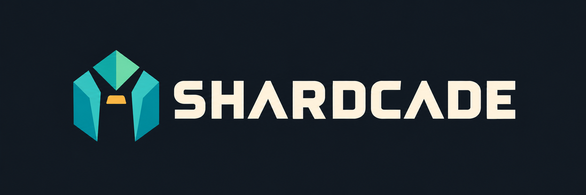

<!-- trunk-ignore-all(markdownlint/MD033) -->
<p align="center">
  
</p>

# Shardcade

**Find it. Import it. Keep it.**

Shardcade is [arcanite24's](https://github.com/arcanite24) fork of
[RomM](https://github.com/rommapp/romm), focused on importing ROMs from external
providers. This README describes our additions, not RomM's existing feature set.
For the original library manager, emulator, metadata, and installation documentation,
see [upstream RomM](https://github.com/rommapp/romm#readme).

## What this fork adds

- **ROM providers screen:** search sources, choose a destination platform, and import
  into the library from the new RomM UI.
- **Reliable Minerva search:** a persistent local SQLite FTS5 index built from
  published torrent manifests. Searches never depend on Minerva's search API.
- **Selective downloads:** fetch the chosen torrent file by exact path and size,
  rather than downloading an entire collection or trusting unstable file indexes.
- **Import queue:** progress, cooperative cancellation, retry, safe staging,
  no-overwrite publication, archive extraction, automatic library registration,
  and a targeted metadata scan before the job completes.
- **HTTP and MEGA:** validated HTTP resume, public MEGA folder/file selection,
  streamed decryption, and integrity verification before import.
- **Native access controls:** administrator-only provider operations using RomM's
  existing authentication and scopes. Library APIs remain compatible with native
  clients such as NeoStation, without an extra Google login gate.
- **18 translated interfaces** for the provider workflow.

## Providers

| Source             | Search               | Import path                                           |
| ------------------ | -------------------- | ----------------------------------------------------- |
| **Minerva**        | Local manifest index | Selective qBittorrent download                        |
| **Axekin**         | Website catalog      | Supported direct, MEGA, or generated host links       |
| **Edge Emulation** | Website search       | HTTP download                                         |
| **Vimm's Lair**    | Vault search         | Browser verification, then generated download URL     |
| **StartGame**      | Platform collections | Website login when required, then direct or MEGA link |

Provider workflows were adapted from the account owner's Phobos ROM manager.
Account requirements, quotas, verification screens, and unavailable files are still
controlled by each source. Shardcade does not bypass them. Unsupported downloads
can use RomM's existing Upload ROMs flow.

## Why Minerva works differently here

The published v3 manifest bundle produced **2,427,933 indexed files** in our validation.
Four GBA-filtered searches took **9–36 ms** on Multivac. These are measured examples,
not performance guarantees. Results include collection names to distinguish releases.

Refreshes checkpoint each manifest and replace the searchable database atomically.
A failed or interrupted refresh leaves the previous index usable. The catalog is
as fresh as Minerva's published manifest bundle; refresh it from the providers page.

## Run this fork

Build from this repository, rather than pulling the official RomM image:

```sh
git clone https://github.com/arcanite24/shardcade.git
cd shardcade
docker build -f docker/Dockerfile --target full-image -t shardcade:local .
```

Use `shardcade:local` as the image in your RomM deployment and enable
`ROM_PROVIDERS_ENABLED=true`. Imports require writable library storage, persistent
index/download storage, and a private qBittorrent instance for Minerva. Switch to
**New UI** under User interface, then open **ROM providers** from the account menu.

See [provider setup and configuration](docs/ROM_PROVIDERS.md) for all environment
variables, volume mappings, permissions, limits, and runnable checks.

Multivac deploys this fork at [roms.multivac.club](https://roms.multivac.club), using
Urithiru for its library and import staging. The deployed image is pinned to a source
revision in Multivac's Compose configuration. NeoStation's server URL is
`https://roms.multivac.club`, with native RomM credentials.

## Validation and current limits

- 10 provider checks, 5 endpoint tests, and 1,233 frontend tests passed.
- A real 240p Test Suite homebrew ROM was downloaded from Minerva and registered.
- Native token refresh, anonymous denial, and an authenticated HTTP 206 range
  download passed on the built image. Physical handheld testing remains separate.
- Browser functional and responsive checks passed; screenshot-based visual review
  remains outstanding because the capture tool failed.
- The Trunk wrapper stalled locally. TypeScript, ESLint, focused mypy, Ruff,
  Black/isort, locale parity, and production builds were checked directly.

## Upstream and license

Shardcade is an independent fork, not an official RomM release. RomM's authors retain
credit for the underlying application. Existing copyright notices and the
[AGPL-3.0 license](LICENSE) are preserved. Fork development, translations, tests, and
the original Shardcade logo were created with AI assistance.
